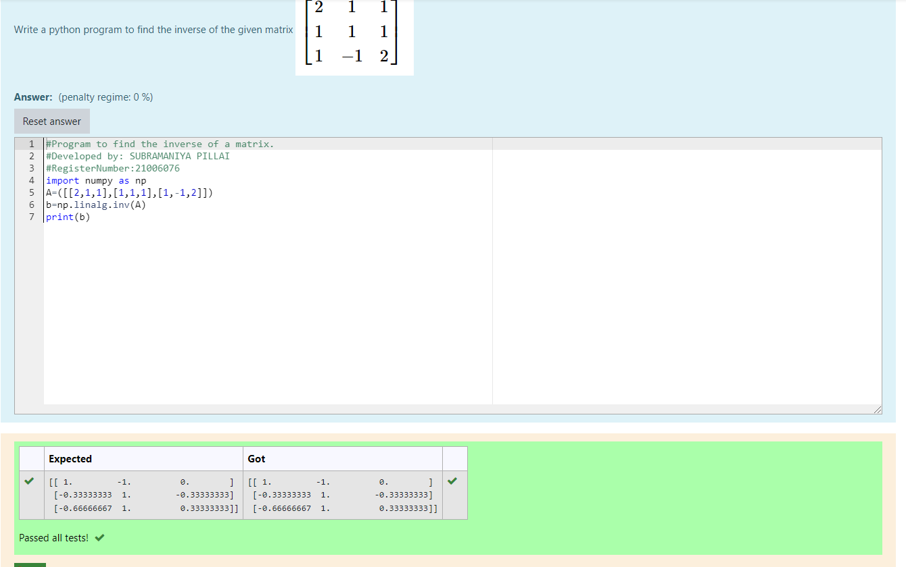

# INVERSE-OF-A-MATRIX
## Aim:
To write a python program to find the inverse of a matrix
## Equipment’s required:
1. 	Hardware – PCs
2. 	Anaconda – Python 3.7 Installation / Moodle-Code Runner
## Algorithm:
### Step1 :
 Import the package numpy
### Step 2: 
An array is initialized using numpy and stored in variable x.
The array is inversed using the function numpy. linalg. inv(x) .
### Step 3: 
Inversed array is stored in variable y.

### Step 4: 
Now we'll print both array x and y.

## Program:
```
import numpy as np
A=([[2,1,1],[1,1,1],[1,-1,2]])
b=np.linalg.inv(A)
print(b)
```
## Output:
## Result:
Thus the inverse of given matrix is successfully solved using python program

